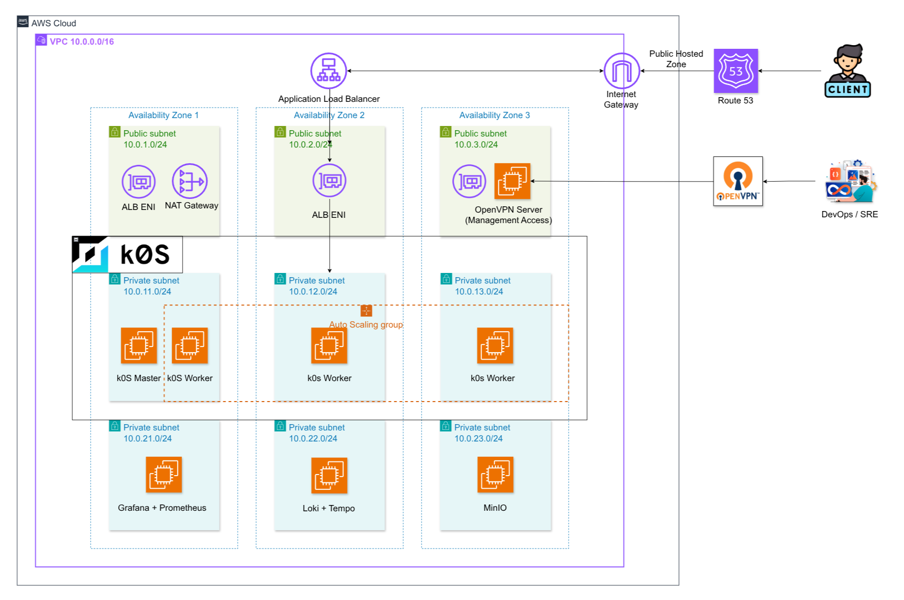

# Terraform Hub – Cloud-Native Infrastructure for Kubernetes

This repository contains the **Infrastructure as Code (IaC)** implementation for provisioning **cloud-native Kubernetes infrastructure on AWS** using **Terraform**.

The Terraform Hub is responsible for defining and managing all **infrastructure-layer resources**, while system configuration, Kubernetes bootstrapping, and observability deployment are handled separately by **Ansible**.

---

## 1. Overview

The objective of this project is to design and provision a **cloud-native infrastructure foundation** capable of supporting Kubernetes clusters in environments that closely resemble real-world production deployments.

---

## 2. Infrastructure Overview

The infrastructure is provisioned using Terraform with a **module-based architecture**.

Each Terraform module is responsible for a specific layer of the infrastructure, including:

- Networking and routing
- Security and IAM
- Compute resources for Kubernetes platforms
- Supporting cloud-native components

Terraform outputs are intentionally structured to be consumed by external automation tools, enabling seamless integration with configuration management and operational workflows.

---

The **environment** serves as a controlled platform for provisioning and validating a Kubernetes-ready infrastructure before applying similar architectural patterns to production environments.



### Environment Characteristics

- Deployment across multiple Availability Zones
- A dedicated VPC with isolated private and public subnets
- Private subnets for Kubernetes nodes and internal services
- Public subnets reserved for controlled management access
- Dedicated infrastructure for observability components
- Controlled outbound internet access via a NAT Gateway

The environment is primarily used to support a **self-managed k0s Kubernetes cluster** deployed on EC2 instances and focuses on validating infrastructure correctness, network isolation, and Kubernetes compatibility.

---

## 3. Provisioning

Initialize and validate the Terraform configuration:

```bash
cd terraform-hub/environments/staging
```

```bash
terraform init
terraform validate
```

Review the execution plan:

```bash
terraform plan
```

Provision the infrastructure:

```bash
terraform apply
```

After the apply step completes, Terraform outputs will expose infrastructure metadata that can be consumed by Ansible for subsequent configuration and Kubernetes bootstrapping steps.

---
